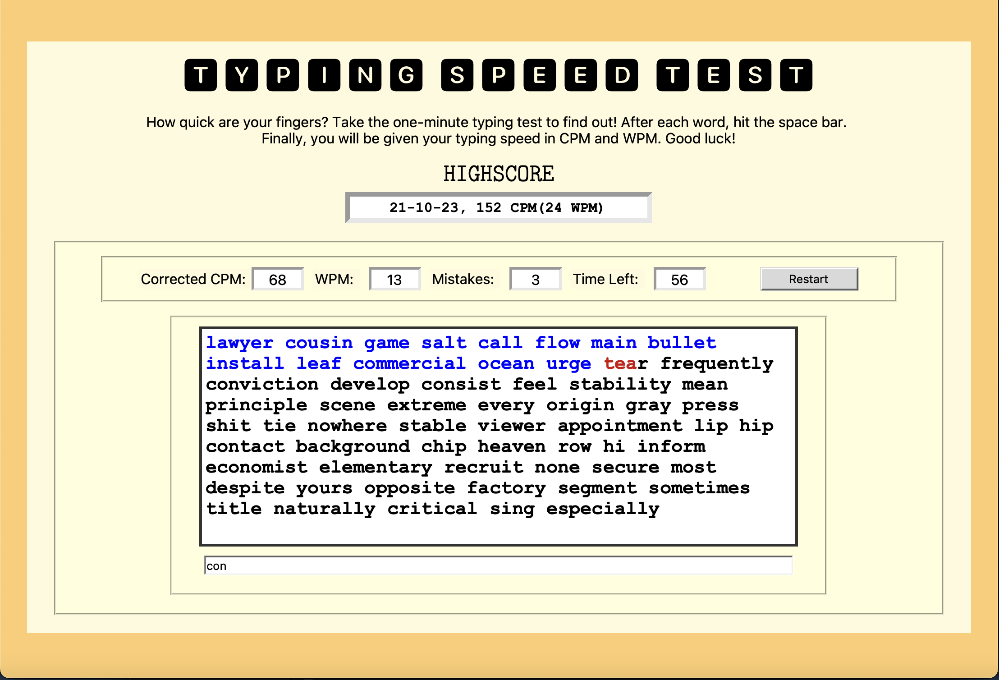

# Typing Speed Test



> Test and improve your typing speed with this simple typing speed application.

## Table of Contents

- [Description](#description)
- [Features](#features)
- [How to Use](#how-to-use)
- [High Scores](#high-scores)
- [Getting Started](#getting-started)
- [Contributing](#contributing)
- [License](#license)

---

## Description

Typing Speed Test is a simple application that allows users to test and improve their typing speed. It provides real-time feedback on gross CPM, net WPM, and tracks mistakes. Users can submit each word by hitting the space bar key and have the option to restart the test at any time.

---

## Features

- Calculate gross CPM (Characters Per Minute).
- Calculate net WPM (Words Per Minute).
- Track and display mistakes.
- High Scores feature to keep track of user's best scores.
- Easy to use and user-friendly interface.

---

## How to Use

1. Clone the repository to your local machine.
```bash
git clone https://github.com/macbrina/TypingTest.git
```

1. Open the project in your preferred Python environment.
2. Run the application by executing python main.py or a similar command.
3. Start typing the displayed words and submit each word with the space bar key.
4. Check your typing speed and mistakes in real-time.
5. Use the Restart button to start a new typing test.

---

## High Scores

The application records your best scores, including net WPM and CPM. High scores are displayed to track your progress and improvements over time.

---

## Getting Started

To get started with this project, you can follow these steps:

1. Clone the repository to your local machine.
````
git clone https://github.com/macbrina/TypingTest.git
````
2. Open the project in your preferred Python environment.
3. Run the application by executing python main.py or a similar command.
4. Start testing your typing speed and have fun!

---

## Contributing
Pull requests and contributions are welcome. Feel free to improve the project and submit your changes.

---

## License
This project is licensed under the [MIT License](LICENSE) - see the [LICENSE](LICENSE) file for details.

